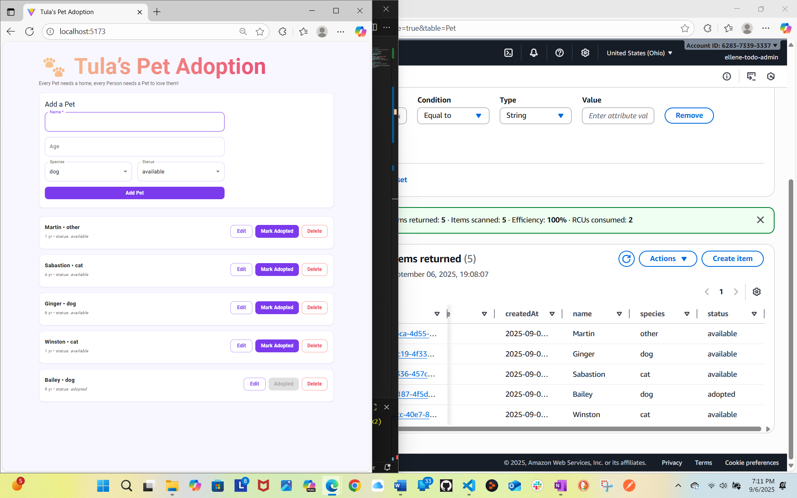

# Tula's Pet Adoption
A light weight React + Vite app with AWS DynamoDB backend, styled with **Material UI (MUI)** and a small **Sass** with a bit of **animation**

https://github.com/ellene-broome/tulas-pet-adoption

## Screen Shot

## Overview
This project is a simple pet adoption app building in small bit size steps.
- Planning
- Creating a React app with Vite
- Preparing AWS files, env and clients stub
- Creating the DynamoDB Pet Table
- Implement CRUD (list/add/adopt/rename/delete)
- Styling with MUI and Sass pallette
- basic simple animation with `<fade>`&`<grow>`
- Split UI into components + add a sticky footer
- Jest + React Testing Library unit tests.
## Tech Stack
- React (Vite)
- AWS DynamoDB
- Material UI
- Sass (SCSS)
- JavaScript
- Jest and react library unit tests
  **Tests SS**
  
## Requirements
- Node.js 18+
- AWS account with an IAM user that has DynamoDB permissions
- Git and GitHub
## Qick Start
```
- Clone your GitHub repo
- git clone https://github.com/ellene-broome/tulas-pet-adoption.git
- cd tulas-pet-adoption
- Install dependencies
    npm install
- Run in dev mode
    npm run dev
```
Open the printed URL
## Environment Variables
Create an .env.local at the project root. **( Do Not Commit )**
```
VITE_AWS_REGION=us-east-2
VITE_AWS_ACCESS_KEY_ID=YOUR_KEY_ID
VITE_AWS_SECRET_ACCESS_KEY=YOUR_SECRET
VITE_DDB_TABLE=Pet
```
Vite only exposes env vars that start w/ VITE_.
Safe Template .env.example included with no secrets
## DynamoDB Setup
Create a Pet table in the same region as VITE_AWS_REGION (us-east-2):
- Table name: Pet
- Partition key: id (String)
- Billing mode: On-demand (default is fine)
## Git ignore safety
```
Env Files:
.env
.env.local
.env.*.local
.env.*
!.env.example
```
## Scripts
```
"scripts": {
  "dev": "vite",
  "build": "vite build",
  "preview": "vite preview",
  "lint": "eslint .",
  "test": "jest",
  "test:watch": "jest --watch"
}
```
## Project Structure
```
tulas-pet-adoption/
├─ public/
├─ src/
│  ├─ assets/
│  │  └─ images/
│  │     └─ tableAndApp.png          
│  ├─ components/
│  │  ├─ AddPetForm.jsx
│  │  ├─ ErrorAlert.jsx
│  │  ├─ Footer.jsx
│  │  ├─ Header.jsx
│  │  ├─ PetItem.jsx
│  │  └─ PetList.jsx
│  ├─ styles/
│  │  ├─ _mixins.scss
│  │  ├─ _palette.scss
│  │  └─ main.scss
│  ├─ _tests_/
│  │  └─ AddPetForm.test.jsx        
│  ├─ App.jsx
│  ├─ aws.js                         
│  ├─ petsApi.js                     
│  ├─ theme.js                       
│  ├─ main.jsx
│  └─ setupTests.js                  
├─ .env.example
├─ index.html
├─ jest.config.cjs
├─ babel.config.cjs
├─ vite.config.js
└─ README.md


```
**(I just figured out that ``` would make my structure stay in a tree)**

